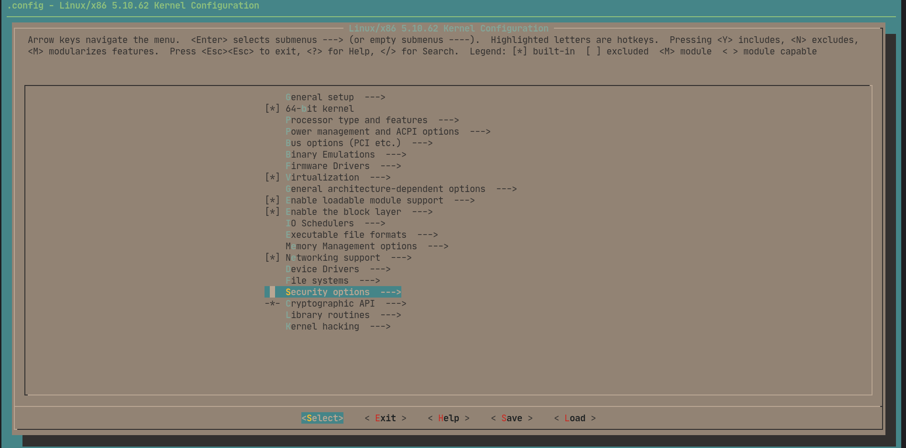
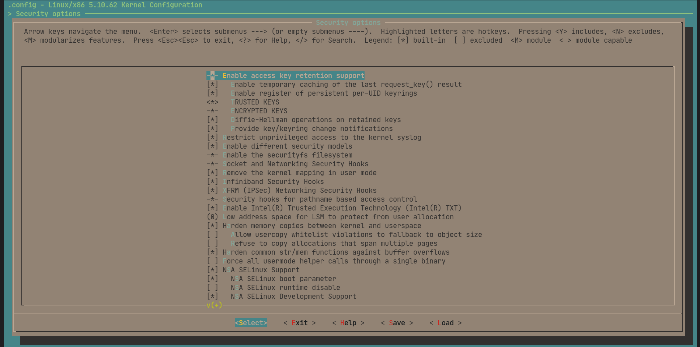
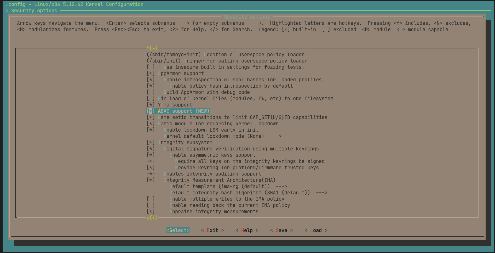

# abac_lsm
Attribute-based Access Control LSM

This repository contains the source code and installation instructions for ABAC Linux Security Module.

# Installation
1. Install system dependencies for building the kernel
```bash
# On Debian Systems
sudo apt-get install build-essential libncurses-dev bison flex libssl-dev libelf-dev

# CentOS/RHEL/Oracle/Scientific Linux
sudo yum groupinstall "Development Tools"
sudo yum install ncurses-devel bison flex elfutils-libelf-devel openssl-devel

# On Fedora
sudo dnf group install "Development Tools"
sudo dnf install ncurses-devel bison flex elfutils-libelf-devel openssl-devel

# For other distributions, please refer to your distributions manual/documentation
```

2. Get the long term release version 5.10.62 from [here](https://cdn.kernel.org/pub/linux/kernel/v5.x/linux-5.10.62.tar.gz) and extract it.
```bash
wget https://cdn.kernel.org/pub/linux/kernel/v5.x/linux-5.10.62.tar.gz
tar xvzf linux-5.10.62.tar.gz
cd linux-5.10.62
```

3. Clone this repository in another terminal
```bash
https://github.com/saivarshith2000/abac_lsm.git`
cd abac_lsm
```

4. Patch the downloaded kernel with code from this repository
```bash
# In the cloned repository directory
cp -r security ../linux-5.10.62/
```

5. Configure
```bash
# In kernel source directory

# your system's current configuration
cp -v /boot/config-$(uname -r) .config

# To enable ABAC LSM
make menuconfig
```
Select Security Options


Make sure that security file system and path-based security modules are enabled


Make sure that ABAC module is selected



6. Build
```bash
# In kernel source directory
make
(or)
make -j$(nproc) # To use all the cores of your system for concurrency
```

7. Install
```bash
# In kernel source directory
sudo make modules_install
sudo make install
```

8. Update Bootloader
```bash
# For grub2 on Debian Systems
sudo update-initramfs -c -k 5.10.62
sudo update-grub

# For grub2 on CentOS/RHEL/Oracle/Scientific and Fedora Linux
sudo grub2-mkconfig -o /boot/grub2/grub.cfg
sudo grubby --set-default /boot/vmlinuz-5.10.62

# For other bootloaders, please refer to your bootloader manual/documentation
```

9. Verify ABAC LSM is enabled
```bash
# Check for ABAC messages in kernel logs
dmesg | grep ABAC 

# Check for ABAC securityFS directory
ls /sys/kernel/security/abac/
```
